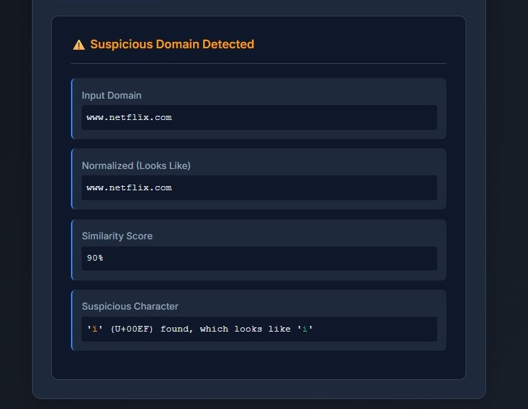
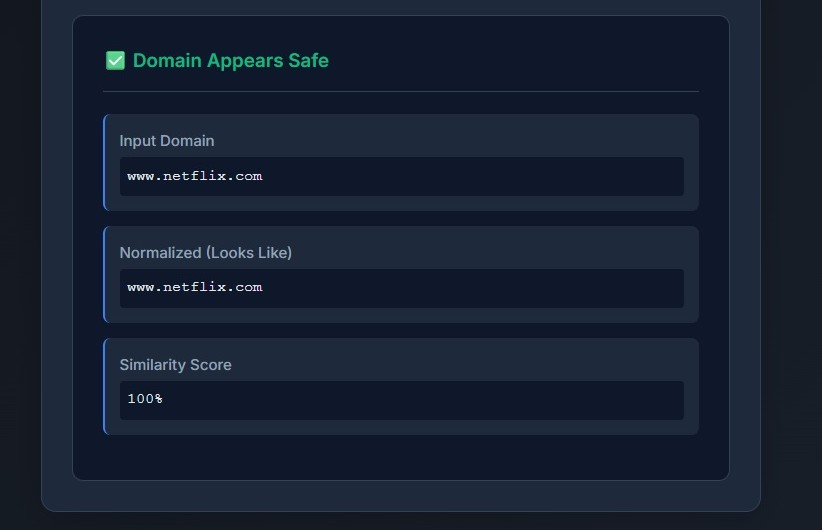
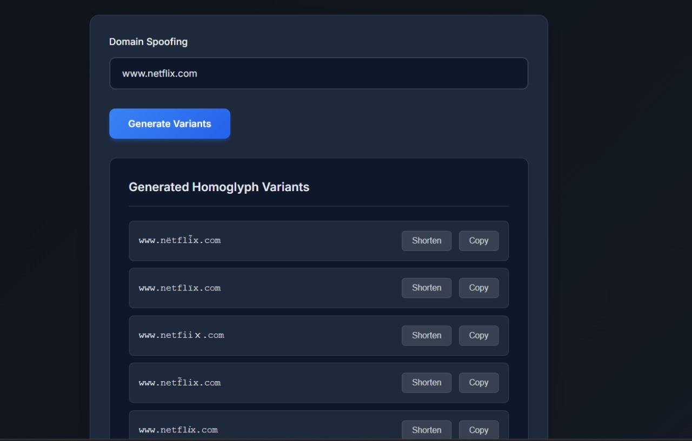
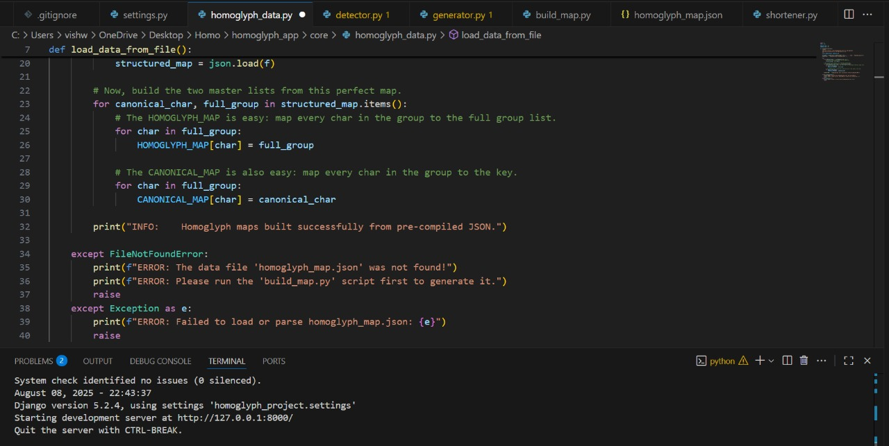

# Homoglyph Toolkit – A Cybersecurity Web Application


A powerful, web-based cybersecurity tool built with Django and Python to both **detect** and **generate** homoglyph domain attacks. This toolkit serves as a practical resource for security analysts, penetration testers, and anyone interested in understanding the deceptive nature of lookalike domains used in phishing attacks.

<p align="center">
  
  
  
</p>

<p align="center">
  
  
  
</p>


---

## 🎯 The Problem: Homoglyph Attacks

Homoglyph attacks exploit the fact that many characters from different alphabets (e.g., Latin, Cyrillic, Greek) or symbols look identical or very similar. Attackers register domains like `gооgle.com` (using Cyrillic 'о's) to trick users into believing they are on a legitimate site, leading to credential theft and malware distribution.

This toolkit provides both defensive and offensive capabilities to combat this threat.

## ✨ Key Features

This application is a "one-stop-shop" for homoglyph analysis, featuring three integrated tools:

### 1. 🛡️ Homoglyph Detector
A robust analysis engine that inspects a domain for multiple types of visual deception:
*   **Cross-Script Detection:** Identifies characters from different alphabets (e.g., Cyrillic `а` vs. Latin `a`).
*   **Combining Marks:** Detects invisible combining characters (e.g., accents) used to modify standard letters (`n` + `̀` → `ǹ`).
*   **Punycode Awareness:** Automatically decodes Punycode domains (`xn--...`) to analyze their true Unicode form.
*   **Similarity Scoring:** Provides a percentage score to quickly gauge how closely a domain resembles its normalized form.

### 2. 🛡️ Homoglyph Generator
An offensive security tool for training, awareness, and red team simulations:
*   **Realistic Variants:** Generates a curated list of high-impact, visually deceptive domain variants from a legitimate input.
*   **Curated Mapping:** Uses a custom, expert-curated JSON map that focuses on the most effective and common character swaps seen in real-world attacks.
*   **Multi-Type Swaps:** Includes not just Unicode homoglyphs but also common visual tricks like `l` → `1`, `o` → `0`, `s` → `$`, and `m` → `rn`.

### 3. 🛡️ URL Shortener
A utility to "weaponize" generated domains for controlled phishing simulations:
*   **One-Click Shortening:** Seamlessly shorten any generated lookalike domain using the TinyURL API.
*   **Integrated Workflow:** Allows for a complete red team workflow, from generating a deceptive domain to creating a ready-to-use shortened link for campaigns.

---

## 🛠️ Tech Stack & Architecture

| Layer         | Technology / Library                                       |
|---------------|------------------------------------------------------------|
| **Language**  | Python 3.11+                                               |
| **Framework** | Django 5.x                                                 |
| **API**       | Django REST Framework (implicit via `JsonResponse`)        |
| **Core Libs** | `requests` (for URL Shortener), `unicodedata` (for normalization) |
| **Frontend**  | Plain HTML, CSS, and JavaScript (No frameworks)            |
| **Database**  | SQLite 3 (Default for Django)                              |

The core of this application is a **pre-compiled, curated data map**. A standalone Python script (`build_map.py`) processes a raw list of Unicode characters and generates a clean `homoglyph_map.json`. The Django application loads this perfect map at startup, ensuring high performance and reliability.

---

## 🚀 Getting Started: Local Setup & Installation

Follow these steps to run the Homoglyph Toolkit locally.

### 1. Prerequisites
- [Python 3.10+](https://www.python.org/downloads/)
- [Git](https://git-scm.com/downloads/)
- Terminal or Command Prompt

### 2. Clone the Repository
```bash
git clone https://github.com/YourUsername/homoglyph-toolkit-django.git
cd homoglyph-toolkit-django
```

### 3. Create & Activate Virtual Environment

```bash
python -m venv venv
venv\Scripts\activate
```

### 4. Install Dependencies
```bash
pip install -r requirements.txt
```

### 5. Build the Homoglyph Map (One-time)
```bash
python build_map.py
```
### 6. Set Up Database 
```bash
python manage.py migrate
```
### 7. Run Development Server
```bash
python manage.py runserver
```
### 8. Open in Browser ---> http://127.0.0.1:8000


You should now see the Homoglyph Toolkit running locally! 🎉


